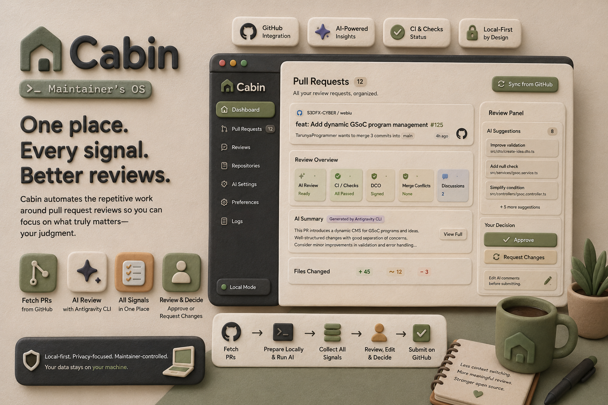

# Cabin — The workspace for code reviewers



> **Cabin** is a local-first development workspace and workflow orchestration platform for open-source maintainers and code reviewers.
> 
> *It is not "yet another AI PR reviewer." It is the operating system for code review.*

---

## 💡 The Philosophy: Workflow Orchestration > AI Reviewers

The market for AI code reviewers is heavily commoditized. Modern developers already have GitHub Copilot, Claude Code, Cursor, Antigravity, and Gemini CLI embedded directly into their editors. 

**The real bottleneck for code maintainers is not the review intelligence itself—it's the workflow orchestration and context gathering.**

### The Problem
Before a maintainer can even begin assessing code, they must manually coordinate a multi-step context collection ritual:
1. Open GitHub and navigate notifications.
2. Read the issue and the surrounding discussion.
3. Understand previous review comments.
4. Verify CI status, test results, and merge conflicts.
5. Fetch the branch locally to run test suites or manually inspect suspicious code blocks.
6. Run local scripts, linters, or AI tools.

Currently, **90% of a maintainer's time is spent gathering context, and only 10% is spent applying human judgment.**

### The Solution: Cabin
Cabin reverses this ratio. It treats GitHub as a database and provides a dedicated, high-performance local workspace where the entire pipeline is automated in the background. 

```
[ GitHub Event ] ──> [ Cabin Local Engine ] ──> [ Gathers Context, Runs Git, Spawns AI ] ──> [ Decision Dashboard ] ──> [ One-Click Approve ]
```

When a notification arrives, Cabin has already prepared the context in **10 seconds**:
* **CI & Checks**: CI passed, DCO signed, no merge conflicts.
* **Aggregated History**: "Contributor addressed accessibility requests and inline styles."
* **Local Run Results**: AI analysis generated, code rules verified.
* **Pre-Drafted Comments**: Smart suggestions ready to post.

You read, decide, and click.

---

## 🏗️ Architecture: Local-First Desktop App

Cabin is designed as a **clean monorepo desktop application** utilizing **Electron** to bridge the high-privilege operations of your machine (filesystem, git, process spawning) with a rich **React** UI dashboard.

```
                    ┌──────────────────────────────────┐
                    │       React UI (packages/ui)     │
                    │   Tailwind + Zustand + Motion    │
                    └─────────────────┬────────────────┘
                                      │ Electron IPC (preload)
                    ┌─────────────────▼────────────────┐
                    │      Electron Main Process       │
                    │      (apps/desktop/src)          │
                    └──────┬──────────┬──────────┬─────┘
                           │          │          │
         ┌─────────────────▼──┐ ┌─────▼──────┐ ┌─▼──────────────────┐
         │ Local Filesystem   │ │ SQLite DB  │ │ CLI Spawner        │
         │ (Repo Clones)      │ │ (Settings, │ │ (Spawn git, ag,   │
         │ ~/Cabin/repos/     │ │ Cache, etc)│ │ other local tools)│
         └────────────────────┘ └────────────┘ └────────────────────┘
```

### Why Electron + React?
* **Zero Browser Sandboxing Limits**: The browser cannot execute terminal commands or clone repositories. Electron's main process handles all high-privilege tasks.
* **Private and Secure**: Your source code, credentials, and API tokens never leave your machine.
* **No Server Costs or Complex Deployments**: Database operations use SQLite locally inside your home directory.
* **Flexible CLI Integration**: Spawning the Antigravity CLI, `git`, or other linters uses Node.js `child_process.spawn()`.

---

## 📦 Package Workspace Structure

The project is managed as an npm workspace monorepo:

```
Dev/
├── package.json                    # Root workspace manager and script launcher
├── tsconfig.json                   # Shared TypeScript compiler options
├── apps/
│   └── desktop/                    # Electron Shell (main and preload processes)
└── packages/
    ├── ui/                         # React UI Frontend (Vite + Tailwind + Zustand + Router)
    ├── database/                   # SQLite controller (sqlite3 + sqlite promise wrapper)
    ├── github/                     # Octokit adapter for GitHub API reviews & comments
    ├── git/                        # simple-git wrapper for repository checkouts
    ├── workers/                    # Pipeline workers (Git, CI, DCO, Merge, Discussion, Context)
    ├── review-engine/              # Orchestrator running pipeline workers in series
    ├── providers/                  # AI Providers (Antigravity CLI command spawner)
    └── shared/                     # Zod schemas, models, and TypeScript types
```

---

## 🚀 How It Works

### 1. Unified Review Inbox
Instead of the noisy GitHub notification feed, Cabin provides a focused queue representing the state of every pending PR:
* **Ready for Review**: CI passed, mergeable, AI checks complete.
* **Blocked / Attention Needed**: CI failing, merge conflicts detected.
* **Awaiting Contributor**: Feedback requested, waiting on fixes.

### 2. Git & Workspace Manager
When you click a PR in the dashboard, the local Git Engine performs the heavy lifting:
* Clones the repository to `~/Cabin/repositories/` if it doesn't exist.
* Automatically fetches the branch and checks out the PR commits.
* Prepares the workspace for inspection or local testing.

### 3. Worker System
Every worker has one responsibility, returning structured JSON reports back to the orchestrator:
* **CI Worker**: Fetches GitHub combined statuses and check runs.
* **Merge Worker**: Verifies branch mergeability and detects conflicts.
* **DCO Worker**: Runs `git log` on the checkout and verifies DCO signatures.
* **Discussion Worker**: Synthesizes issue and review comments into structured threads.
* **Repository Context Worker**: Scans for README rules, contributing guides, and PR templates.

### 4. AI CLI Runner (The child_process Bridge)
Cabin connects directly to your local command-line tools. When a review is triggered, the Electron main process's `aiService` spawns the Antigravity CLI process:
```typescript
// Spawns: ag review --pr 218
const process = spawn('ag', ['review', '--pr', prNumber], { cwd: repoPath });
```
*Outputs are streamed to the React UI in real-time, giving you console progress updates.*

### 5. Automated Chores & Comment Generator
Review findings are mapped to editable markdown templates. You can click a button, preview the generated comment (optionally humanized by an LLM), and post it directly to GitHub in a single action.

---

## 🛠️ Development Setup & How to Run

### Prerequisites
* Node.js (v18+)
* Git CLI installed and configured
* GitHub Personal Access Token (PAT) (with `repo` permissions)

### Setup
1. **Install dependencies:**
   ```bash
   npm install
   ```
2. **Build the packages:**
   Compile the monorepo workspace packages in order:
   ```bash
   npm run build:all
   ```

### Start in Development Mode
To run Cabin locally:
1. **Start the React dev server (Terminal 1):**
   ```bash
   npm run dev:ui
   ```
2. **Launch the Electron window (Terminal 2):**
   ```bash
   npm run dev:desktop
   ```
   Electron will boot up and load the React UI running on `http://localhost:5173`.
